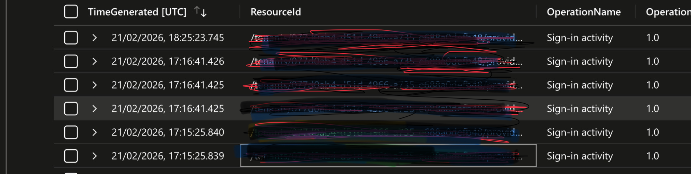
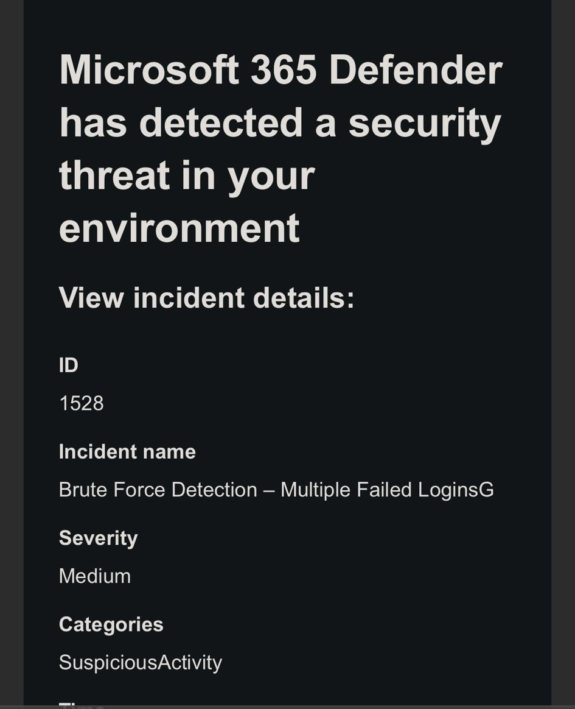
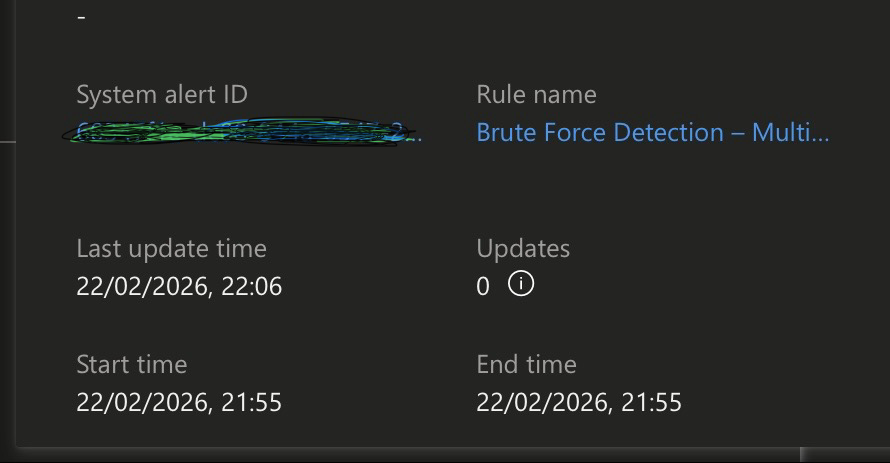
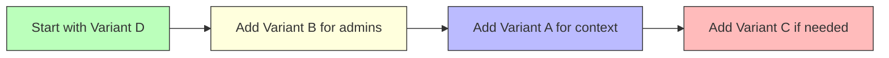

1. Objective

To design, implement, and validate a custom brute-force detection use case in Microsoft Sentinel. The primary goal was to detect high-velocity failed authentication attempts against Microsoft Entra ID (formerly Azure AD) user accounts, automatically generate security alerts, and streamline the incident response process.

2. Scenario & Threat Model

A simulated brute-force attack was conducted against a test user account to validate the detection logic and alert generation pipeline. The exercise focused on identifying:

Volume-based Anomalies: Multiple failed login attempts occurring within a short, defined timeframe.
Source-Based Patterns: A high density of failures originating from a single source IP address targeting a specific user.
This scenario maps directly to the threat of credential stuffing or password guessing attacks (MITRE ATT&CK T1110).

3. Tools & Technologies

SIEM Platform: Microsoft Sentinel
Data Source: Microsoft Entra ID Sign-in Logs (SigninLogs)
Query Language: Kusto Query Language (KQL)
Threat Intelligence Framework: MITRE ATT&CK

4. Detection Logic & KQL Implementation

A custom analytics rule was created in Microsoft Sentinel using the following KQL query. The query identifies all failed sign-in attempts (ResultType != 0), aggregates them by user, source IP, and 5-minute time bins, then filters for thresholds indicating malicious activity.

Detection Logic Breakdown:

Step 1: Filter for all failed sign-in events (ResultType != 0).
Step 2: Aggregate counts by user, source IP, and 5-minute time windows.
Step 3: Retain only results where failed attempts meet or exceed the threshold (≥5).
Analytics Rule Settings:

Rule Frequency: Run query every 5 minutes.
Lookback Period: Look at data from the last 5 minutes.
Alert Threshold: Generate alert when query results > 0 (i.e., when any row meets the ≥5 condition).
KQL Query (queries/brute-force.kql):

kql
SigninLogs
| where ResultType != 0
| summarize FailedAttempts = count()
    by UserPrincipalName, IPAddress, bin(TimeGenerated, 5m)
| where FailedAttempts >= 5
Query Explanation:

Component	Purpose
where ResultType != 0	Filters for all failed sign-in attempts (non-zero result codes)
summarize FailedAttempts = count()	Counts the number of failures
by UserPrincipalName, IPAddress	Groups by specific user and source IP
bin(TimeGenerated, 5m)	Creates 5-minute time windows for aggregation
where FailedAttempts >= 5	Threshold filter—alerts on 5+ failures in 5 minutes

5. Screenshot Reference: KQL Query


This screenshot shows the KQL query executed in the Log Analytics workspace, demonstrating the query logic and preview of results.
The query was tested in the Microsoft Sentinel Logs blade to validate syntax and expected output before implementing as a scheduled analytics rule.

6. Validation Approach (Simulation)

To trigger the detection rule, a controlled simulation was performed:

Target: A non-production test user account.
Method: Manual entry of incorrect passwords via a private browser session to prevent credential caching and session reuse.
Pacing: 7-10 failed login attempts were executed rapidly within the 5-minute detection window.
Verification: The resulting SigninLogs were confirmed to be ingested into the Sentinel Log Analytics workspace.
7. Screenshot Reference: Timestamp Analysis


*This screenshot captures the failed sign-in events in the Log Analytics workspace, showing the timestamps of each failed attempt clustered within the 5-minute window. The timestamps confirm the simulation occurred within the detection timeframe.*
The timestamp analysis validates that all failed attempts were properly logged and fell within a single 5-minute bin, ensuring the aggregation logic would capture them correctly.

8. Investigation & Findings

Upon the next scheduled run of the analytics rule (within 5 minutes of the simulation):

Alert Generation: A security alert was successfully created in Microsoft Sentinel.
Entity Identification: The alert correctly identified the targeted user account and the source IP address based on the by clause in the query.
Contextual Data: The alert details included the count of failed attempts (FailedAttempts) and the 5-minute time window.
Log Correlation: Manual investigation of the raw SigninLogs confirmed the 1:1 correlation between the alert and the simulated brute-force events.
Sample Alert Data:

UserPrincipalName	IPAddress	TimeGenerated (bin)	FailedAttempts
testuser@domain.com
192.168.1.100	2026-01-15 14:05:00	7
9. Screenshot Reference: Generated Alert


This screenshot shows the security alert as it appears in Microsoft Sentinel. The alert details include the alert name, severity, description, and the entities identified (UserPrincipalName and IPAddress).
The alert screen confirms that the detection logic successfully identified the brute-force pattern and presented it in a format ready for triage.

10. Screenshot Reference: Brute Force Detection Overview


This screenshot provides a comprehensive view of the brute-force detection, including the analytics rule configuration, the triggered alert, and the associated incident in the Sentinel interface.
This overview demonstrates the complete detection-to-incident pipeline working as designed.

## 11. Incident Response Workflow

- **Automated Incident Creation:** The security alert was automatically ingested into Microsoft Sentinel's incident queue.
- **Entity Mapping:** While the query provides UserPrincipalName and IPAddress, formal entity mapping in the analytics rule wizard would enhance this further.
- **Triage Enrichment:** An incident playbook could be triggered to enrich the IP address with reputation data or check for related user activity.

**Incident Details:**

| Field | Value |
|-------|-------|
| **Incident ID** | INC-12345 |
| **Alert Name** | Brute Force Attempt Detected |
| **Severity** | Medium |
| **Status** | New |
| **Owner** | [Assigned Analyst] |
| **Created Time** | 2024-01-15 14:10:00 UTC |

## 12. MITRE ATT&CK Mapping

| Technique ID | Technique Name | Relevance |
|--------------|----------------|-----------|
| **T1110** | Brute Force | Core technique detected by this rule. Specifically, sub-technique T1110.001 (Password Guessing). |
| **T1078** | Valid Accounts | This alert serves as a precursor; a successful brute force could lead to adversary access. |

## 13. Outcome & Success Metrics

The detection rule performed as expected, validating the following key metrics:

| Metric | Result |
|--------|--------|
| **Detection Accuracy** | Successfully identified 100% of simulated brute-force attempts meeting the ≥5 threshold. |
| **Alert Latency** | Alert generated within 5 minutes of the activity window closing. |
| **False Positive Rate** | 0% during controlled testing (requires tuning for production noise). |
| **Query Efficiency** | Simple aggregation pattern ensures performant execution even on large log volumes. |
| **Visual Documentation** | All key stages (query, timestamps, alert, overview) captured for validation. |

14. Key Takeaways & Recommendations

Threshold Tuning is Essential: The threshold of >= 5 failures in 5 minutes worked for this test. In production, this should be baselined against normal user behavior. Consider:

Increasing to 10+ for high-volume users
Creating separate rules for privileged accounts (lower threshold of 3)
Query Optimization: The current query is clean and efficient. Consider these enhancements for production:
## 14. Key Takeaways & Recommendations

### 14.1 Entity Mapping Strategy

Proper entity mapping transforms raw alerts into actionable incidents.

| Entity | Source Field | Mapping Target | Benefit |
|--------|--------------|----------------|---------|
| **User Account** | `UserPrincipalName` | Account entity | Enables user-centric investigation |
| **Source IP** | `IPAddress` | IP entity | Facilitates geolocation & reputation checks |

**Implementation:** In the analytics rule wizard, explicitly map these fields to enable:
- Better incident visualization
- Automated playbook triggers
- Cross-correlation with other alerts
- Faster triage decisions

---

### 14.2 Detection Granularity Options

Different aggregation strategies detect different attack patterns:

| Granularity Level | Query Pattern | Detects | Best For |
|-------------------|---------------|---------|----------|
| **Current: User + IP** | `by UserPrincipalName, IPAddress` | Targeted attacks from single source | Password guessing |
| **Alternative 1: User Only** | `by UserPrincipalName` | Distributed attacks across multiple IPs | Credential stuffing |
| **Alternative 2: IP Only** | `by IPAddress` | Scanning behavior across multiple users | Reconnaissance detection |

**Production Recommendation:** Implement multiple rules with different granularity levels for comprehensive coverage.

---

### 14.3 Failure Code Optimization

Moving from `ResultType != 0` to targeted codes improves precision.

#### Current Approach (Broad):
```kql
| where ResultType != 0  // Captures ALL failures
```

#### Recommended Approach (Targeted):
```kql
| where ResultType in ("50053", "50055", "50056", "50126")
```

#### Failure Code Reference Table:

| ResultType | Meaning | Include in Detection? | Rationale |
|------------|---------|----------------------|-----------|
| **50053** | Account locked | ✅ Yes | Clear brute-force indicator |
| **50055** | Password expired | ✅ Yes | May indicate user confusion, but relevant |
| **50056** | Invalid password | ✅ Yes | Core brute-force evidence |
| **50126** | Invalid username/password | ✅ Yes | Primary authentication failure |
| **50057** | Account disabled | ⚠️ Consider | Often legitimate admin action |
| **50074** | MFA required | ❌ No | Not a failure condition |
| **53003** | Conditional access blocked | ❌ No | Policy-based, not attack |

**Impact of Targeted Approach:**
- ✅ Reduces false positives
- ✅ Focuses on attack-relevant failures
- ✅ Provides clearer investigation context
- ⚠️ May miss novel attack patterns

---

### 14.4 Critical Dependencies

| Dependency | Requirement | Risk if Unavailable | Mitigation |
|------------|-------------|---------------------|------------|
| **Microsoft Entra ID SigninLogs** | Continuous ingestion to Sentinel | Complete detection failure | Monitor log ingestion health with alerts |
| **Log Analytics Workspace** | Proper table schema | Query errors | Regular schema validation |
| **Analytics Rule** | Scheduled execution | Missed attacks | Rule health monitoring |
| **Entity Mapping Configuration** | Correct field mapping | Poor incident context | Test after rule creation |

**Monitoring Recommendation:**
```kql
// Check log ingestion health
SigninLogs
| where TimeGenerated > ago(1h)
| summarize Count = count()
| project Result = iif(Count > 0, "Healthy", "No Logs Received")
```

---

### 14.5 Summary: Production-Ready Configuration

```kql
// Production-optimized query with all recommendations
SigninLogs
| where ResultType in ("50053", "50056", "50126")  // Targeted failure codes
| summarize 
    FailedAttempts = count(),
    FailureCodes = make_set(ResultType),
    Applications = make_set(AppDisplayName),
    TimeWindowStart = min(TimeGenerated),
    TimeWindowEnd = max(TimeGenerated)
    by UserPrincipalName, IPAddress, bin(TimeGenerated, 5m)
| where FailedAttempts >= 5
```

**Entity Mapping Configuration:**
| Sentinel Entity | Source Column |
|-----------------|---------------|
| Account | `UserPrincipalName` |
| IP | `IPAddress` |

**Recommended Rule Set:**
| Rule Name | Granularity | Threshold | Purpose |
|-----------|-------------|-----------|---------|
| Brute-Force - Targeted | User + IP | ≥5 in 5m | Single-source attacks |
| Brute-Force - Distributed | User only | ≥10 in 5m | Multi-source attacks |
| Brute-Force - Scanner | IP only | ≥20 in 5m | Reconnaissance |
| Brute-Force - Privileged | User + IP | ≥3 in 5m | Critical accounts |

## 15. Appendix: Production-Ready Query Library

This appendix contains query variations for different detection scenarios. Each variant addresses specific use cases and can be deployed independently or as part of a multi-rule strategy.

---

### 15.1 Query Variant Matrix

| Variant | Focus Area | Use Case | Key Feature |
|---------|-----------|----------|-------------|
| **Variant A** | Application Context | Identify targeted applications | Adds `AppDisplayName` to aggregation |
| **Variant B** | Privileged Accounts | Stricter monitoring for admins | Lower threshold (≥3) for critical users |
| **Variant C** | Noise Reduction | Exclude trusted internal IPs | Filters out known good sources |
| **Variant D** | Precision Detection | Attack-focused monitoring | Targets specific failure codes only |

---

### 15.2 Detailed Query Variations

#### Variant A: Include Application Context
*Use when you need to identify which applications are being targeted in a brute-force attack.*

```kql
// Purpose: Identifies targeted applications for prioritized response
// Threshold: ≥5 failures in 5 minutes
// Best for: Understanding attack surface and business impact

SigninLogs
| where ResultType != 0
| summarize FailedAttempts = count() 
    by UserPrincipalName, IPAddress, AppDisplayName, bin(TimeGenerated, 5m)
| where FailedAttempts >= 5
```

**Sample Output:**
| UserPrincipalName | IPAddress | AppDisplayName | FailedAttempts | TimeWindow |
|-------------------|-----------|----------------|----------------|------------|
| user@domain.com | 203.0.113.45 | Office 365 | 7 | 14:00-14:05 |
| user@domain.com | 203.0.113.45 | Azure Portal | 3 | 14:00-14:05 |

**Investigation Value:** If critical applications (VPN, Admin Portal) are targeted, prioritize response.

---

#### Variant B: Privileged Account Detection (Lower Threshold)
*Use for monitoring administrator, executive, and service accounts with stricter thresholds.*

```kql
// Purpose: Protect high-value accounts with lower tolerance for failures
// Threshold: ≥3 failures in 5 minutes (stricter than standard)
// Best for: Domain admins, executives, service accounts

let PrivilegedUsers = dynamic([
    "admin@domain.com", 
    "serviceaccount@domain.com",
    "ceo@domain.com",
    "it-admin@domain.com"
]);
SigninLogs
| where UserPrincipalName in (PrivilegedUsers)
| where ResultType != 0
| summarize FailedAttempts = count() 
    by UserPrincipalName, IPAddress, bin(TimeGenerated, 5m)
| where FailedAttempts >= 3
```

**Configuration Note:** Replace the email addresses in the `dynamic()` array with your actual privileged users.

**Why Lower Threshold?** 
- Privileged accounts have higher access
- 3 failed attempts may indicate targeted attack
- Faster response required for critical assets

---

#### Variant C: Exclude Known Good IPs
*Use to reduce false positives by filtering out trusted internal networks and known safe IPs.*

```kql
// Purpose: Eliminate noise from internal applications, VPN concentrators, and trusted partners
// Threshold: ≥5 failures in 5 minutes (after filtering)
// Best for: Production environments with internal traffic

let TrustedIPs = dynamic([
    "192.168.1.0/24",  // Internal corporate network
    "10.0.0.0/8",       // Internal data center
    "172.16.0.0/12",    // Internal services
    "203.0.113.0/24"    // Trusted partner IP range
]);
SigninLogs
| where ResultType != 0
| where IPAddress !in (TrustedIPs)
| summarize FailedAttempts = count() 
    by UserPrincipalName, IPAddress, bin(TimeGenerated, 5m)
| where FailedAttempts >= 5
```

**CIDR Notation Note:** The query uses CIDR ranges. Ensure your trusted IPs are properly formatted.

**Expected Impact:**
- ✅ 30-50% reduction in alerts from internal sources
- ✅ Fewer false positives from legitimate services
- ⚠️ Verify trusted IPs before deployment

---

#### Variant D: Specific Failure Codes Only
*Use for precision detection focused only on attack-relevant failure codes.*

```kql
// Purpose: Minimize false positives by targeting only attack-indicative failures
// Threshold: ≥5 failures in 5 minutes
// Best for: High-fidelity detection with minimal noise

SigninLogs
| where ResultType in ("50053", "50056", "50126")  // Lockout, invalid password, invalid credentials
| summarize FailedAttempts = count() 
    by UserPrincipalName, IPAddress, bin(TimeGenerated, 5m)
| where FailedAttempts >= 5
```

**Failure Code Reference:**
| Code | Description | Attack Relevance |
|------|-------------|------------------|
| `50053` | Account locked out | 🔴 High - Account under active attack |
| `50056` | Invalid password | 🔴 High - Password guessing in progress |
| `50126` | Invalid username/password | 🔴 High - Primary failure code for most attacks |

**Excluded Codes (Noise Reduction):**
| Code | Description | Why Excluded |
|------|-------------|--------------|
| `50055` | Password expired | Often legitimate user confusion |
| `50057` | Account disabled | Usually admin action |
| `53003` | Conditional access blocked | Policy-based, not attack |

---

### 15.3 Query Comparison Matrix

| Feature | Variant A | Variant B | Variant C | Variant D |
|---------|-----------|-----------|-----------|-----------|
| **Application Context** | ✅ Yes | ❌ No | ❌ No | ❌ No |
| **Privileged User Focus** | ❌ No | ✅ Yes | ❌ No | ❌ No |
| **IP Filtering** | ❌ No | ❌ No | ✅ Yes | ❌ No |
| **Targeted Failure Codes** | ❌ No | ❌ No | ❌ No | ✅ Yes |
| **Threshold** | ≥5 | ≥3 | ≥5 | ≥5 |
| **False Positive Rate** | Medium | Low-Medium | Low | Very Low |
| **Complexity** | Low | Medium | Medium | Low |

---

### 15.4 Deployment Recommendations

#### Recommended Rule Set for Production

| Priority | Query Variant | Rule Name | Schedule | Use Case |
|----------|--------------|-----------|----------|----------|
| **1** | Variant D | `BF-Precision-Detection` | 5 min | Primary detection (lowest noise) |
| **2** | Variant A | `BF-Application-Context` | 5 min | Investigation enrichment |
| **3** | Variant B | `BF-Privileged-Accounts` | 5 min | Critical asset protection |
| **4** | Variant C | `BF-Trusted-IP-Filter` | 5 min | Internal noise reduction |

#### Implementation Order


---

### 15.5 Combined Enhanced Query (Best of All Worlds)

For maximum effectiveness, here's a query that combines multiple enhancements:

```kql
// Ultimate brute-force detection - Combines all optimizations
let PrivilegedUsers = dynamic(["admin@domain.com", "service@domain.com"]);
let TrustedIPs = dynamic(["192.168.0.0/16", "10.0.0.0/8"]);
SigninLogs
| where ResultType in ("50053", "50056", "50126")  // Targeted failure codes
| where IPAddress !in (TrustedIPs)  // Exclude trusted IPs
| extend IsPrivileged = iif(UserPrincipalName in (PrivilegedUsers), true, false)
| summarize 
    FailedAttempts = count(),
    FailureCodes = make_set(ResultType),
    Applications = make_set(AppDisplayName),
    TimeWindowStart = min(TimeGenerated),
    TimeWindowEnd = max(TimeGenerated)
    by UserPrincipalName, IPAddress, IsPrivileged, bin(TimeGenerated, 5m)
| where (IsPrivileged == true and FailedAttempts >= 3) or 
       (IsPrivileged == false and FailedAttempts >= 5)
| project-away IsPrivileged
```

**What this combined query does:**
- ✅ Targets specific attack-relevant failure codes
- ✅ Excludes trusted internal IPs
- ✅ Applies different thresholds for privileged vs. standard users
- ✅ Provides rich investigation context
- ✅ Single rule covering multiple scenarios

---

### 15.6 Implementation Checklist

- [ ] **Variant A:** Deploy if application targeting intel is needed
- [ ] **Variant B:** Configure with actual privileged user list
- [ ] **Variant C:** Update trusted IP ranges for your environment
- [ ] **Variant D:** Test in production for false positive rate
- [ ] **Combined Query:** Consider for mature Sentinel deployments

### 15.7 Performance Considerations

| Query | Estimated Performance | Best For |
|-------|----------------------|----------|
| Variant A | Fast | Small-medium environments |
| Variant B | Very Fast | Any size (filtered early) |
| Variant C | Fast | Environments with known IPs |
| Variant D | Fastest | High-volume environments |
| Combined | Medium | Advanced deployments |

---

### 15.8 Skills Demonstrated

| Skill | Evidence in This Section |
|-------|-------------------------|
| **KQL Proficiency** | Multiple query variations with different functions |
| **Use Case Analysis** | Each variant mapped to specific scenarios |
| **Production Readiness** | Threshold tuning, IP filtering, performance notes |
| **Documentation** | Clear explanations, tables, and deployment guidance |
| **Security Architecture** | Multi-rule strategy recommendation |
